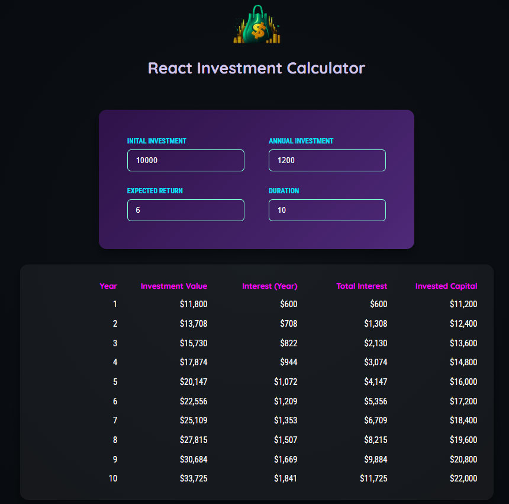

# 🚀 React Investment Calculator

An educational React app that projects investment growth over time. Built with Vite for fast development and simple learning. Enter investment parameters and get a projected final value.

## Features

- Enter initial investment, periodic contribution, interest rate, and duration
- See final investment value and a concise summary
- Minimal, readable implementation using React + Vite

## Tech

- React
- Vite
- JavaScript (ESM)

## Quick Start

Clone the repository and install dependencies:

```bash
git clone https://github.com/lxlnimalxl/React-Investment-Calculator-Project.git
cd React-Investment-Calculator-Project
npm install
```

Run development server:

```bash
npm run dev
```

Build for production:

```bash
npm run build
```

## Project Structure

- `index.html` — App entry
- `src/` — React source files
- `src/components/` — UI components
- `src/util/investment.js` — Calculation logic

## Screenshot



## Contributing

Issues and pull requests are welcome. Please open an issue for significant changes before sending a PR.

## License

This project is licensed under the MIT License.
